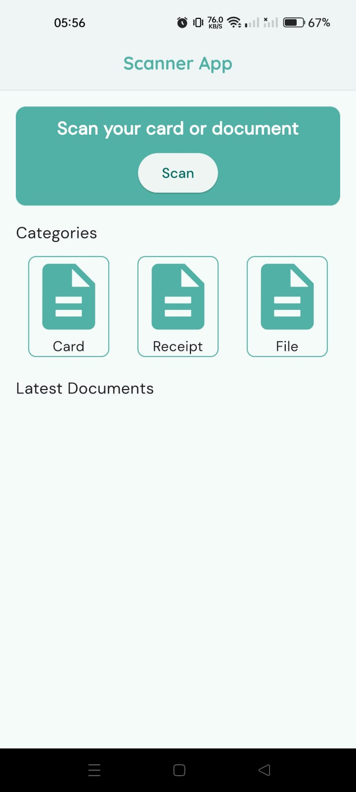
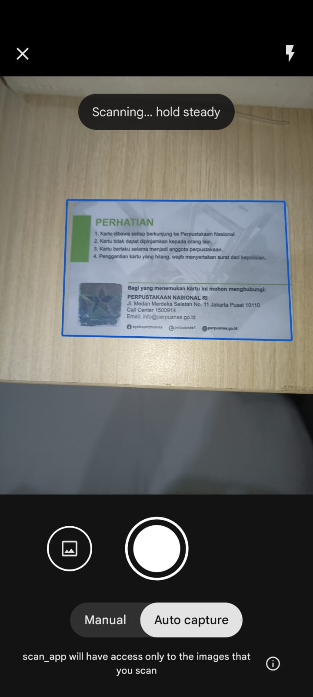
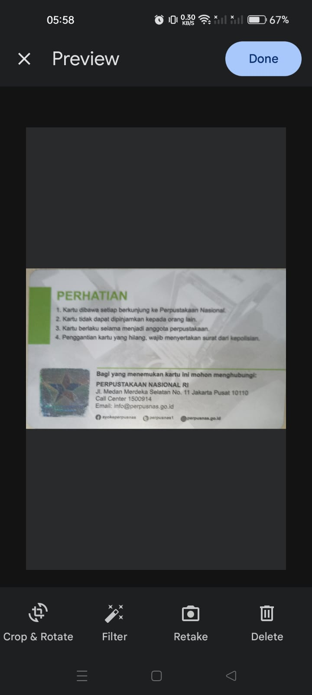
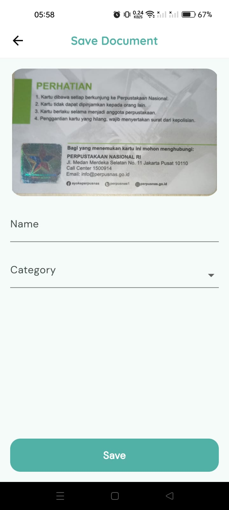
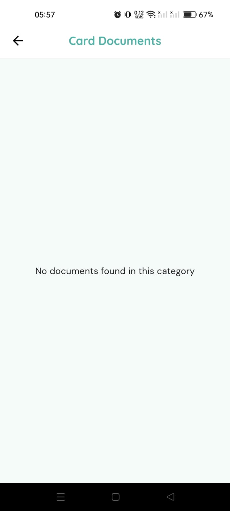
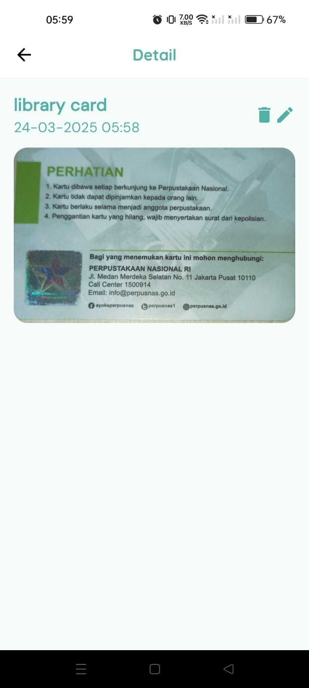
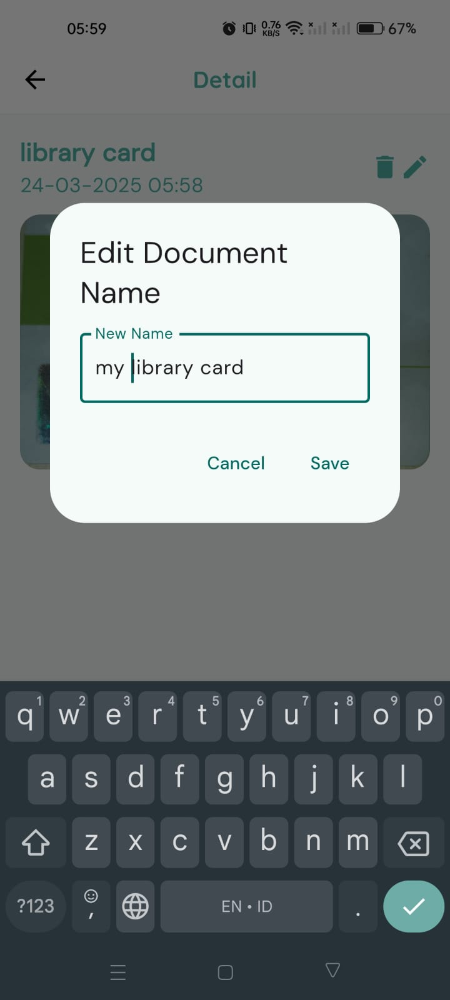

# 📄 Scanner App  
A Flutter-based document scanner app built with ❤️ using Flutter and Dart.  

---

## 🚀 Features  
✅ Scan documents using the device camera  
✅ View scanned document details  
✅ Edit document names  
✅ Delete documents  
✅ Store and retrieve documents locally  

---

## ⚠️ Limitations  
⚠️ Currently works only on **Android** 
⚠️ State management using `setState` (May update to Provider or Riverpod in future)  

---

## 🖥️ Screenshots  
| Home Page | Scanning Page | Preview Page | Save Document Page | Category Page | Detail Page |  
|-----------|---------------|--------------|--------------------|---------------|-------------|
|   
| 
| 
| 
|  
|  |  

---

## 📲 Installation  
1. **Clone the repository:**  
git clone https://github.com/your-username/scanner-app.git
2. **Install depedencies:**  
flutter pub get
2. **Run the app:**  
flutter pub get

## ⚙️ Configuration 
No additional configuration required.

## ⬇️ Download
[Download the APK]
(https://github.com/anggtpd/Simple-Scanner-App/blob/main/app-release.apk)

## 🛠️ Built With
- Flutter 3.24.4
- Dart 3.5.4
- google_mlkit_document_scanner: ^0.2.1
- sqflite: ^2.4.1

## 🌟 Contributing
- Pull requests are welcome! If you find any issues, feel free to open an issue or create a pull request.